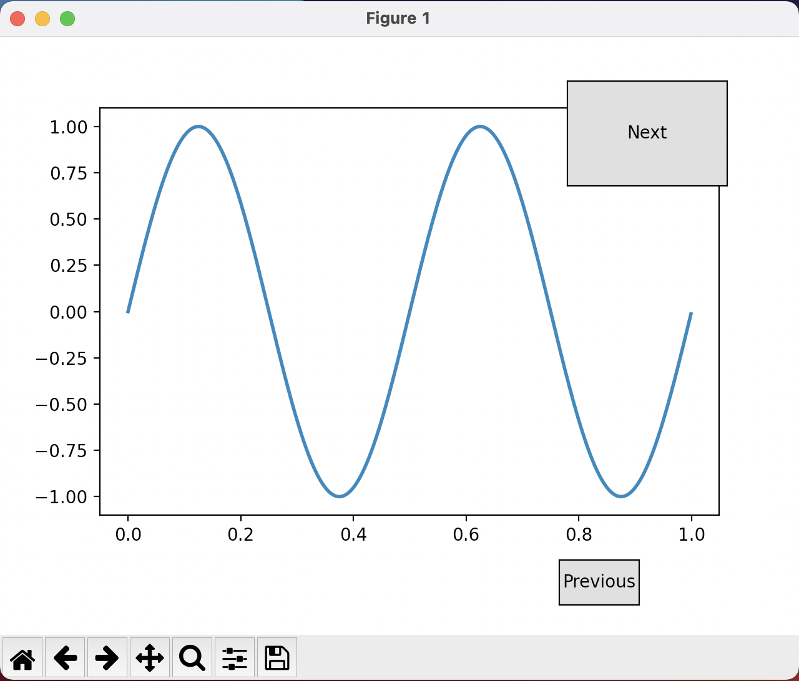

# Learning `matplotlib`

## About

A picture is worth a thousand words, and with Python’s matplotlib library,
it fortunately takes far less than a thousand words of code to create a production-quality graphic.

However, matplotlib is also a massive library,
and getting a plot to look just right is often achieved through trial and error.
Using one-liners to generate basic plots in matplotlib is fairly simple,
but skillfully commanding the remaining 98% of the library can be daunting.

## The construction


## Buttons

```python
import numpy as np
import matplotlib.pyplot as plt
from matplotlib.widgets import Button

freqs = np.arange(2, 20, 3)

fig, ax = plt.subplots()
fig.subplots_adjust(bottom=0.2)
t = np.arange(0.0, 1.0, 0.001)
s = np.sin(2*np.pi*freqs[0]*t)
l, = ax.plot(t, s, lw=2)


class Index:
    ind = 0

    def next(self, event):
        self.ind += 1
        i = self.ind % len(freqs)
        ydata = np.sin(2*np.pi*freqs[i]*t)
        l.set_ydata(ydata)
        plt.draw()

    def prev(self, event):
        self.ind -= 1
        i = self.ind % len(freqs)
        ydata = np.sin(2*np.pi*freqs[i]*t)
        l.set_ydata(ydata)
        plt.draw()

callback = Index()
axprev = fig.add_axes([0.7, 0.05, 0.1, 0.075])
axnext = fig.add_axes([0.71, 0.75, 0.2, 0.175])
bnext = Button(axnext, 'Next')
bnext.on_clicked(callback.next)
bprev = Button(axprev, 'Previous')
bprev.on_clicked(callback.prev)

plt.show()
```

<!--  -->


## Examples

### Example 1 - [`example1.py`](example1.py)

<!--  -->


### Example 2 - [`example2.py`](example2.py)

<!--  -->


### Example 3 - Plotting During The Run

Plot live examples in [`plot_live_1.py`](plot_live_1.py), [`plot_live_2.py`](plot_live_2.py) and [`plot_live_3.py`](plot_live_3.py).

```python
PLOT_LIVE = True
if PLOT_LIVE:
    fig, _ = plt.subplots(nrows=2, ncols=3, figsize=(12, 6))


def plot(self, graph_dict):
    if PLOT_LIVE:
        ax = self.fig.get_axes()
        for indx, (k, v) in enumerate(graph_dict.items()):
            ax[indx].cla()
            ax[indx].plot(list(range(len(v))), v, c='r')  # , edgecolor='b')
            ax[indx].set_title(f'Plot: {k}')
            ax[indx].set_xlabel('iters')
            ax[indx].set_ylabel(f'{k}')
        plt.pause(0.05)
```

<!--  -->


#### Another Option for Life Plotting

```python
from drawnow import drawnow
```
### Tricks

#### Change `figsize` in `plt` mode

You need to plug `plt.rcParams["figure.figsize"] = [6.4, 6.4]` before plotting.

## Credits

- [plot live - 1 (stackoverflow)](https://stackoverflow.com/questions/28269157/plotting-in-a-non-blocking-way-with-matplotlib)
- [plot live - 2 (stackoverflow)](https://stackoverflow.com/questions/11874767/how-do-i-plot-in-real-time-in-a-while-loop-using-matplotlib)
- [clr - clear figure (stackoverflow)](https://stackoverflow.com/questions/8213522/when-to-use-cla-clf-or-close-for-clearing-a-plot-in-matplotlib)
- [Live Updating Graphs with Matplotlib Tutorial](https://pythonprogramming.net/python-matplotlib-live-updating-graphs/)
- [Real Python Tutorial - Python Plotting With Matplotlib (Guide)](https://realpython.com/python-matplotlib-guide/)
- [Real Python Tutorial - An Intro to Threading in Python](https://realpython.com/intro-to-python-threading/#using-a-threadpoolexecutor)
- [Real Python Tutorial - https://realpython.com/python-concurrency/](https://realpython.com/python-concurrency/)
- [Matplotlib - Docs](https://matplotlib.org/2.0.2/examples/showcase/anatomy.html)


