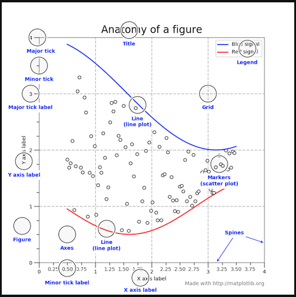

# Learning `matplotlib`

## About

A picture is worth a thousand words, and with Python’s matplotlib library,
it fortunately takes far less than a thousand words of code to create a production-quality graphic.

However, matplotlib is also a massive library,
and getting a plot to look just right is often achieved through trial and error.
Using one-liners to generate basic plots in matplotlib is fairly simple,
but skillfully commanding the remaining 98% of the library can be daunting.

## The construction

## Credits

- [Live Updating Graphs with Matplotlib Tutorial](https://pythonprogramming.net/python-matplotlib-live-updating-graphs/)
- [Real Python Tutorial - Python Plotting With Matplotlib (Guide)](https://realpython.com/python-matplotlib-guide/)
- [Real Python Tutorial - An Intro to Threading in Python](https://realpython.com/intro-to-python-threading/#using-a-threadpoolexecutor)
- [Real Python Tutorial - https://realpython.com/python-concurrency/](https://realpython.com/python-concurrency/)
- [Matplotlib - Docs](https://matplotlib.org/2.0.2/examples/showcase/anatomy.html)

